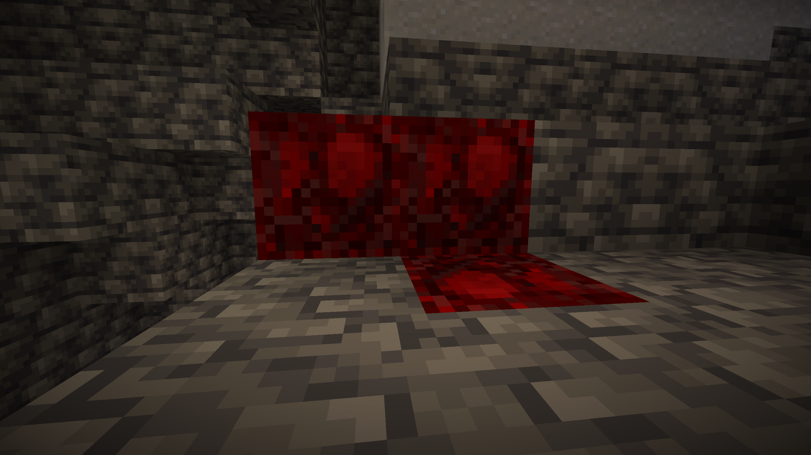

# more-enchantments-template-1.20
#### 学习制作 Fabric Mod
## More Enchantments 更多附魔
- 为 Minecraft Fabric 1.20 添加更多附魔书
## 附魔书 Enchantment Books
### 祝福恢复
- 最高等级为3级
- 附魔冲突：
  - *嗜血*
- 攻击生物会随机恢复生命值
- 有概率触发“真理之选择！”
  - 效果为概率恢复所有HP
### 灵魂穿透
- 最高等级为4级
- 直击灵魂！无视护甲值造成伤害
- 附魔的武器伤害越高，穿透灵魂的伤害也会更高
### 缴械
- 最高等级为1级
- 攻击敌对生物会使生物主手持有的物品掉落
### 重击
- 最高等级为3级
- 攻击生物会给予缓速效果
- 根据附魔等级提升持续时间
### 饱食
- 最高等级为1级
- 攻击生物会有五分之一的概率恢复自身一格饱食度
### 嗜血
- 最高等级为3级
- 只能附魔在剑上
- 附魔冲突：
  - *祝福恢复*
- 攻击生物造成的伤害根据等级恢复自身
### 钻石无处不在
- 最高等级为4级
- 只能附魔在镐子上
- 挖掘部分矿物会有概率掉落钻石
- 受时运影响，有概率掉落更多钻石
  - 支持的矿物:
  
### 生机勃勃
- 最高等级为5级
- 只能附魔在胸甲上
- 提升佩戴者的最大生命值上限
- 根据附魔等级提升，每提升一级增加两点生命值，初始为两点生命值
### 点石成金
- 挖取石头有概率掉落金粒
- 支持的方块：

## 物品 Items
### 连跳法杖

- 跳跃后右键即可*~左脚踩右脚飞天！~*
### 心之容器

- 挖取“心之矿石”掉落
- 使用物品可恢复一定的血量
## 方块 Blocks
### 心之矿石

- 生成于主世界Y坐标-16层数以下
- 挖取会掉落心之容器
